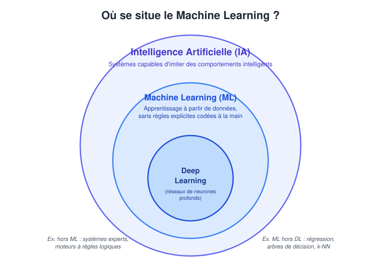
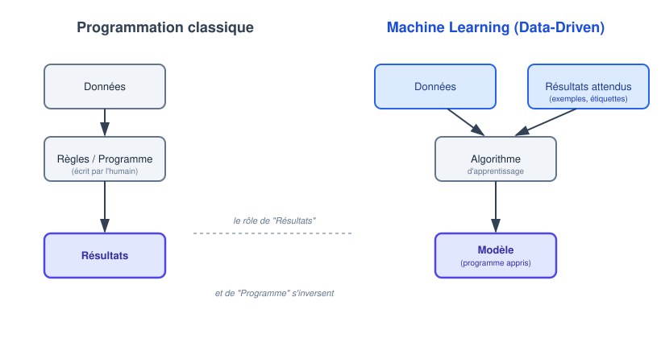
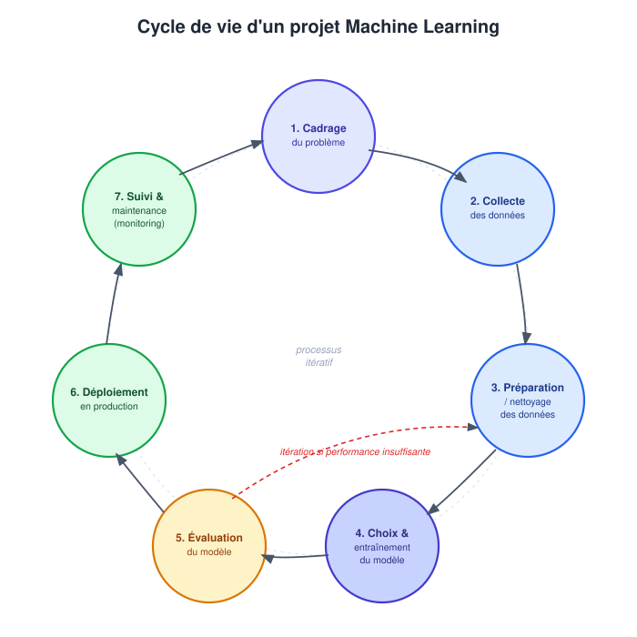

# Introduction au Machine Learning

::: {.callout-tip title="Objectifs du chapitre"}
À la fin de ce chapitre introductif, l'étudiant sera capable de :

- **Définir** formellement le Machine Learning et le **situer** dans l'écosystème de l'Intelligence Artificielle ;
- **Comparer** le paradigme de programmation classique et l'approche guidée par les données (*Data-Driven*) ;
- **Identifier** les grandes étapes du cycle de vie d'un projet de Machine Learning ;
- **Identifier** les outils de base utilisés dans ce cours (Python, JupyterLab, `pandas`, Scikit-Learn et `uv`).
:::

## 1. Machine Learning 

### 1.1. De l'Intelligence Artificielle au Machine Learning

L'**Intelligence Artificielle (IA)** est le champ scientifique le plus large : il regroupe l'ensemble des théories et techniques mises en œuvre pour concevoir des machines capables de simuler des comportements associés à l'intelligence humaine - raisonner, percevoir, planifier, comprendre le langage, ou encore apprendre.

::: {.callout-note title="Repère historique" collapse="true"}
Le terme *Artificial Intelligence* est proposé en 1956 lors de la conférence de Dartmouth. Pendant plusieurs décennies, l'IA « symbolique » domine : on cherche à reproduire l'intelligence en manipulant des symboles et des règles logiques explicites. Ce n'est qu'à partir des années 1990-2010, avec l'explosion des données disponibles et de la puissance de calcul, que le **Machine Learning statistique** devient l'approche dominante de l'IA.
:::

Historiquement, les premiers systèmes d'IA reposaient sur des **systèmes experts** : des ensembles de règles logiques (`SI ... ALORS ...`) écrites explicitement par des humains. Ils fonctionnaient bien dans des domaines circonscrits, mais s'avéraient extrêmement coûteux à maintenir et incapables de s'adapter à des situations non anticipées.

Le **Machine Learning (ML)** constitue une rupture : plutôt que de coder explicitement toutes les règles de décision, on utilise un algorithme pour apprendre, à partir d'exemples, un **modèle** capable de produire des prédictions sur de nouvelles données. Le modèle ne fournit pas toujours des règles lisibles ; il représente surtout une relation mathématique entre les données d'entrée et la sortie attendue.

Le **Deep Learning (Apprentissage Profond, DL)** est un **sous-domaine du ML** qui repose sur des réseaux de neurones artificiels comportant de nombreuses couches, performants sur des données non structurées (images, son, texte).

{#fig-venn-ia-ml-dl}

Comme le montre la @fig-venn-ia-ml-dl, ces trois notions s'emboîtent comme des poupées russes : chaque cercle est un cas particulier du cercle qui l'englobe.

::: {.callout-tip title="À retenir"}
Tout algorithme de Deep Learning est un algorithme de Machine Learning, et tout algorithme de Machine Learning appartient au champ de l'IA - mais la réciproque est fausse (ex : un algorithme de recherche aux échecs, comme Minimax, est de l'IA sans être du ML, car il n'apprend rien à partir de données).
:::

### 1.2. Définition formelle du Machine Learning

La définition de référence est celle de [@mitchell1997machine] :

::: {.callout-tip}
## Apprentissage Automatique (Machine Learning)

::: {#def-ml}
On dit qu'un programme informatique apprend à partir d'une expérience `E`, par rapport à une classe de tâches `T` et une mesure de performance `P`, si sa performance aux tâches de `T`, mesurée par `P`, s'améliore avec l'expérience `E`.
:::
:::

Cette définition se décompose en trois éléments concrets qui doivent être clairement identifiés **avant** de commencer tout projet. Voici son application pour un `filtre anti-spam` :

| Symbole | Signification | Exemple : filtre anti-spam |
|:---|:---|:---|
| **`T`** (Task) | La tâche que le système doit accomplir | Classer un e-mail comme *spam* ou *non-spam* |
| **`P`** (Performance) | La métrique d'évaluation | Proportion d'e-mails correctement classés |
| **`E`** (Experience) | Les données d'apprentissage | Une base d'e-mails déjà étiquetés |

: Le cadre TPE de @mitchell1997machine appliqué au filtre anti-spam {#tbl-mitchell}


::: {.callout-tip title="Exemple"}
Reprenons ce triplet pour un second cas d'usage : un système destiné à **prédire si un client va résilier son abonnement téléphonique** (*churn*).

- **`T`** : prédire, pour chaque client, s'il résiliera dans les 30 prochains jours (classification binaire) ;
- **`P`** : le taux de bonnes prédictions sur des clients dont on connaît déjà l'issue réelle (mesuré sur des données jamais utilisées pour l'entraînement) ;
- **`E`** : l'historique des abonnements passés (durée, factures, appels au service client, résiliations effectives).

Cette grille de lecture (`T`, `P`, `E`) est fondamentale : avant même de choisir un algorithme, tout projet ML doit répondre clairement à ces trois questions.
:::

Le chapitre suivant détaillera en profondeur les paradigmes d'apprentissage. Retenons pour l'instant que la première distinction à connaître oppose :

- **L'apprentissage supervisé**, où le système dispose des « bonnes réponses » pendant l'entraînement (ex. régression, classification) ;
- **L'apprentissage non-supervisé**, où le système ne dispose que des données brutes, sans réponse attendue (ex. clustering).

## 2. Programmation classique vs. approche Data-Driven

### 2.1. Le paradigme classique

Dans le paradigme **classique** (déductif), le développeur déduit un ensemble de **règles explicites**, puis les traduit en code. Le programme prend des **données** en entrée et produit des **résultats** en appliquant mécaniquement ces règles.

Prenons l'exemple du `filtre anti-spam` **codé « à la main »** :

```python
def est_spam(email: str) -> bool:
    """
    Approche par règles explicites (programmation classique).
    Retourne:
    True si l'email contient un mot suspect,
    False sinon.
    """
    mots_suspects = ["gratuit", "gagner", "urgent", "viagra"]
    email_minuscule = email.lower()
    return any(mot in email_minuscule for mot in mots_suspects)
```

Ce type d'approche est idéal lorsque les règles métier sont **stables, peu nombreuses et bien comprises** (ex. calcul d'un impôt selon un barème officiel). Mais dès que les spammeurs changent de vocabulaire, la règle doit être **réécrite manuellement** - le programme n'apprend rien de lui-même.

### 2.2. Le paradigme Data-Driven

Le Machine Learning **inverse la logique** : on fournit au système des **données** et, dans le cas supervisé, les **résultats attendus** correspondants. Un **algorithme d'apprentissage** analyse les régularités entre ces deux éléments pour produire un **modèle**. Ce modèle est une fonction apprise automatiquement, capable de généraliser à de nouvelles données jamais vues.

```python
from sklearn.feature_extraction.text import TfidfVectorizer
from sklearn.linear_model import LogisticRegression
from sklearn.pipeline import make_pipeline

# Un texte doit d'abord être transformé en nombres.
modele = make_pipeline(
    TfidfVectorizer(),
    LogisticRegression(max_iter=1000)
)
modele.fit(X_entrainement, y_entrainement)
prediction = modele.predict([nouvel_email])
```

Ici^[Nous allons détailler et comprendre cette structure ainsi que l'algorithme utilisé dans les chapitres suivants.], personne n'a écrit explicitement la règle « si le mot X apparaît, alors spam » : c'est l'algorithme `fit()` qui l'a **déduite statistiquement** à partir des exemples fournis.


{#fig-paradigme-programmation}

La @fig-paradigme-programmation résume visuellement cette inversion : ce qui était une **sortie** (les résultats) dans la programmation classique devient une **entrée** (les résultats attendus, ou étiquettes) dans le paradigme Data-Driven.

| Critère | Programmation classique | Machine Learning |
|:---|:---|:---|
| Fourni par l'humain | Règles + Données | Données + Résultats attendus (exemples) |
| Produit par le système | Résultats | Un modèle (règles apprises) |
| Adaptation | Faible (réécriture du code) | Élevée (réentraînement) |
| Interprétabilité | Totale | Variable selon le modèle |
| Besoin en données | Faible | Généralement élevé |

: Comparaison synthétique des deux paradigmes {#tbl-comparaison-paradigmes}

::: {.callout-warning title="Remarque"}
Le Machine Learning **n'est pas une solution universelle**. Si un problème admet une règle simple, déterministe et bien comprise (ex. conversion d'unités), la programmation classique reste souvent plus fiable, plus rapide à développer et plus facile à auditer qu'un modèle statistique.
:::

## 3. Le cycle de vie d'un projet de Machine Learning

Entraîner un modèle ne représente qu'une fraction du travail réel. Un projet ML se décompose en sept étapes itératives [@geron2022] :

1. **Cadrage du problème métier** : traduire un besoin en problème ML via la grille (T, P, E) - voir @def-ml.
2. **Collecte des données** : rassembler un jeu de données représentatif du phénomène à modéliser.
3. **Préparation et nettoyage** : étape souvent très chronophage, dont la durée varie selon le projet. Elle comprend notamment le traitement des valeurs manquantes, l'encodage des variables catégorielles et la création de nouvelles variables (*feature engineering*).
4. **Modélisation** : choix des algorithmes et entraînement sur les données pour minimiser une erreur.
5. **Évaluation** : mesurer objectivement la performance sur des données jamais vues (jeu de test).
6. **Déploiement** : intégrer le modèle dans un système opérationnel (application, API, tableau de bord).
7. **Monitoring** : surveiller les performances en production pour détecter la **dérive des données** (*data drift*) et déclencher un réentraînement si nécessaire.


{#fig-cycle-vie-ml}


Nous allons appliquer ces sept étapes à un exemple concret : prédire les prix immobiliers à Casablanca.

::: {.callout-tip title="Étude de cas"}

1. **Cadrage** : une agence immobilière veut estimer automatiquement le prix d'un bien à partir de ses caractéristiques (`T` = régression ; `P` = erreur moyenne en MAD ; `E` = annonces passées).
2. **Collecte** : extraction de 15 000 annonces publiées sur les 3 dernières années (surface, quartier, étage, prix de vente réel).
3. **Préparation** : suppression des annonces dupliquées, traitement des surfaces manquantes, encodage du quartier.
4. **Modélisation** : entraînement d'une régression linéaire (chapitre 3) sur 80 % des données.
5. **Évaluation** : mesure de l'erreur sur les 20 % restants, jamais vus pendant l'entraînement.
6. **Déploiement** : intégration du modèle dans le simulateur de prix du site web de l'agence.
7. **Monitoring** : si le marché immobilier casablancais évolue fortement (nouvelle infrastructure, crise économique), les prix prédits deviendront obsolètes - d'où la nécessité d'un suivi continu.
:::

Il est essentiel de comprendre que ce cycle **n'est presque jamais parcouru une seule fois de façon linéaire**. Une évaluation décevante à l'étape 5 renvoie très souvent vers l'étape 3 (améliorer les variables) ou l'étape 4 (changer d'algorithme), plus rarement vers l'étape 1.

## 4. Python pour le Machine Learning

Pour mener à bien ce cycle, le choix du langage de programmation constitue une étape importante. L'écosystème du *Machine Learning* s'appuie sur plusieurs langages, chacun disposant de domaines d'utilisation et de points forts spécifiques. Parmi eux, [**R**](https://r-project.org), largement utilisé dans les domaines de la Statistique et de l'analyse de données, [**Julia**](https://julialang.org), conçu notamment pour le calcul scientifique et la performance numérique, ainsi que [**C++**](https://isocpp.org) et [**Java**](https://dev.java), qui sont également présents dans de nombreux contextes de développement logiciel et d'applications à fortes contraintes de performance ou d'intégration.

Dans le cadre de ce cycle, nous retenons [**Python**](<https://python.org>) comme langage principal. Ce choix s'explique notamment par la lisibilité de sa syntaxe, la richesse de son écosystème scientifique et sa large utilisation dans les domaines de l'analyse de données, de l'intelligence artificielle et du *Machine Learning*. Python permet ainsi de couvrir différentes étapes d'un projet, depuis la préparation et l'exploration des données jusqu'à l'entraînement, l'évaluation et la mise en œuvre de modèles.


### 4.1. Quelques bibliothèques scientifiques de l'écosystème Python

L'écosystème Python comprend notamment [**NumPy**](https://numpy.org) pour le calcul numérique, [**pandas**](https://pandas.pydata.org) pour la manipulation et l'analyse des données, [**scikit-learn**](https://scikit-learn.org) pour les principales méthodes d'apprentissage automatique, ainsi que [**TensorFlow**](https://tensorflow.org) et [**PyTorch**](https://pytorch.org) pour le développement de modèles d'apprentissage profond.

| Bibliothèque | Rôle dans le cycle de vie du projet |
|:---|:---|
| `pandas` | Manipulation et nettoyage de tableaux de données (DataFrames). |
| `numpy` | Calcul numérique, calcul matriciel et opérations mathématiques optimisées. |
| `matplotlib` / `seaborn` | Visualisation et exploration visuelle des données. |
| `scikit-learn` | Algorithmes classiques de régression, classification, clustering et outils de prétraitement. |

: Quelques bibliothèques principales de l'écosystème Python utilisées dans le cycle {#tbl-ecosysteme}

Chaque bibliothèque de la @tbl-ecosysteme correspond typiquement à une ou plusieurs étapes du cycle de vie présenté en @fig-cycle-vie-ml : `pandas` intervient surtout aux étapes 2-3, `scikit-learn` à l'étape 4 et `matplotlib` accompagne l'ensemble du processus. Les bibliothèques plus spécialisées seront laissées de côté dans ce cours introductif.

### 4.2. Environnements de développement : exploration et production {#sec-outils}

Il convient de distinguer la phase d'**exploration et de prototypage** de la phase de **développement et de mise en production**. Ces deux étapes peuvent mobiliser des outils différents, car leurs objectifs et leurs contraintes ne sont pas les mêmes.

Dans ce cours, nous adoptons une organisation simple et progressive : les **notebooks Jupyter**, notamment à travers **JupyterLab** et **Google Colab**, seront privilégiés pour l'exploration et le prototypage, tandis que **Visual Studio Code (VS Code)** sera utilisé pour structurer et finaliser le code destiné à la production.

Ce choix constitue une convention pédagogique propre à ce cours. Il existe naturellement d'autres environnements et plateformes, tels que **DataSpell**, **PyCharm**, **Databricks** et d'autres solutions, qui peuvent être pertinents selon les contextes, les projets et les habitudes de développement.

::: {.panel-tabset}

## 🔎 Exploration et prototypage

**JupyterLab**

: JupyterLab est un environnement de développement interactif permettant notamment de travailler avec des *notebooks* Jupyter, constitués de cellules de texte et de code pouvant être exécutées indépendamment. Il est particulièrement adapté à l'exploration d'un jeu de données, à la visualisation des résultats et à la documentation progressive du raisonnement. **JupyterLab constituera l'un des principaux environnements utilisés pour les travaux pratiques de ce cours.**

**Google Colab**

: Google Colab est un environnement de *notebooks* hébergé dans le cloud. Il permet d'exécuter du code Python sans nécessiter l'installation préalable d'un environnement de développement local et facilite le partage des notebooks. Selon les ressources disponibles et le type de compte utilisé, des ressources de calcul spécialisées, notamment des GPU, peuvent également être proposées. L'environnement d'exécution étant temporaire, les fichiers et les résultats importants doivent être sauvegardés dans un emplacement persistant.

## 🏗️ Développement et production

**Visual Studio Code (VS Code)**

: Visual Studio Code est un éditeur de code généraliste que nous utiliserons pour passer du code exploratoire à une organisation plus structurée du projet. Il permet notamment de travailler avec des fichiers Python, de structurer le code en modules, de gérer les dépendances et l'environnement du projet, d'utiliser Git, d'écrire et d'exécuter des tests, puis de préparer le code pour son déploiement sous différentes formes, par exemple sous la forme d'une API ou d'un service web.

:::

::: {.callout-warning title="Pourquoi ne pas tout faire dans un seul notebook ?"}

Un notebook est particulièrement adapté à l'expérimentation et à l'exploration interactive. Cependant, au fur et à mesure qu'un projet se complexifie, conserver l'ensemble du code dans un ou plusieurs notebooks peut rendre sa maintenance, sa réutilisation, ses tests et son déploiement plus difficiles. Les notebooks peuvent également conserver un **état d'exécution implicite**, notamment lorsque les cellules sont exécutées dans un ordre différent de celui dans lequel elles apparaissent.

Dans ce cours, nous adopterons donc une démarche progressive :

1. **explorer et expérimenter dans un notebook** ;
2. **valider les choix méthodologiques et le fonctionnement du modèle** ;
3. **consolider le code dans des fichiers Python (`.py`) structurés et réutilisables** ;
4. **tester, versionner et préparer le projet pour son utilisation finale ou son déploiement**.

Il ne s'agit pas d'opposer les notebooks au développement logiciel : les notebooks restent utiles pour l'exploration, l'analyse et la présentation des résultats, tandis que les fichiers Python structurés sont généralement plus adaptés lorsque le code doit être maintenu, testé et réutilisé dans un projet plus important.

:::

### 4.3. Gestion de projet avec `uv` {#sec-uv}

Un projet de *Machine Learning* ne dépend pas uniquement du code que nous écrivons. Il repose également sur un **environnement logiciel** : une version de Python, un ensemble de bibliothèques, des versions compatibles de ces bibliothèques et différents outils nécessaires à l'exécution du projet.

La gestion de cet environnement est importante dès qu'un projet doit être **reproduit, partagé, maintenu ou déployé**. Deux utilisateurs disposant du même code peuvent, par exemple, rencontrer des problèmes différents si leurs versions de Python ou de certaines dépendances ne sont pas les mêmes. La gestion des dépendances constitue ainsi une composante essentielle de la reproductibilité et de la maintenance d'un projet.

Dans ce cours, nous présenterons d'abord l'approche classique de l'écosystème Python, puis nous adopterons `uv` comme outil de gestion de nos projets.

#### L'approche classique : Python, `venv` et `pip`

L'écosystème Python fournit déjà les outils nécessaires pour créer un environnement isolé et installer les bibliothèques d'un projet. Le module [`venv`](https://docs.python.org/3/library/venv.html) est l'outil standard de Python pour créer des environnements virtuels. Ceux-ci permettent d'isoler les dépendances d'un projet de celles installées dans les autres projets ou dans l'installation générale de Python.

L'installation des bibliothèques s'effectue généralement avec [`pip`](https://pip.pypa.io/), l'installateur de paquets Python. Les bibliothèques sont notamment disponibles sur [`PyPI`](https://pypi.org/), le Python Package Index.

Une configuration classique peut donc être représentée de manière simplifiée par :

```bash
python -m venv .venv
```

puis, dans l'environnement virtuel :

```bash
python -m pip install numpy pandas scikit-learn
```

Les dépendances peuvent ensuite être consignées dans un fichier `requirements.txt`, par exemple :

```text
numpy
pandas
scikit-learn
```

Cette approche est parfaitement valable et reste largement utilisée. Le [Python Packaging User Guide](https://packaging.python.org/) présente d'ailleurs cette organisation ainsi que les pratiques modernes de gestion et de distribution des projets Python.

Elle présente cependant une certaine fragmentation : la création de l'environnement, la gestion des dépendances et leur installation sont assurées par des mécanismes distincts. Pour des projets plus structurés, il devient également utile de disposer d'une déclaration centralisée des dépendances et d'un mécanisme de verrouillage permettant de conserver une résolution précise de l'environnement.

#### Vers une gestion moderne du projet avec `pyproject.toml`

Les projets Python modernes utilisent notamment le fichier [`pyproject.toml`](https://packaging.python.org/en/latest/specifications/pyproject-toml/). Ce fichier permet de centraliser différentes informations relatives au projet, notamment ses métadonnées et ses dépendances.

Il constitue aujourd'hui un élément central de l'écosystème de *packaging* Python et est utilisé par de nombreux outils modernes.

Dans ce cours, nous allons nous appuyer sur [`uv`](https://docs.astral.sh/uv/), développé par Astral, pour gérer nos projets Python.

#### Pourquoi `uv` ?

`uv` est un gestionnaire de projets et de paquets Python qui regroupe dans un même outil plusieurs opérations auparavant réalisées avec différents outils. Il permet notamment de gérer les projets Python, les environnements virtuels, les versions de Python, les dépendances et leur résolution, ainsi que l'exécution des commandes dans l'environnement du projet.

La documentation officielle de [`uv` présente](https://docs.astral.sh/uv/getting-started/features/) notamment les fonctions suivantes :

* création d'un projet avec `uv init` ;
* ajout et suppression de dépendances ;
* gestion de l'environnement virtuel du projet ;
* synchronisation des dépendances ;
* création et mise à jour du fichier de verrouillage ;
* exécution de commandes dans l'environnement du projet ;
* gestion de projets plus complexes au moyen de *workspaces*.

L'intérêt de `uv` dans notre cours est donc moins de remplacer une commande particulière que de fournir une **organisation cohérente de l'ensemble du projet Python**.

#### `pyproject.toml`, `uv.lock` et `.venv`

Avec `uv`, trois éléments sont particulièrement importants.

Le fichier `pyproject.toml` décrit le projet et ses besoins, notamment les dépendances et la version de Python requise.

Le fichier `uv.lock` enregistre la résolution précise des dépendances du projet. Contrairement au fichier `pyproject.toml`, qui exprime les besoins du projet de manière générale, le fichier de verrouillage conserve les versions effectivement résolues. Il peut ainsi être versionné avec le projet afin de faciliter la reconstruction d'un environnement cohérent sur différentes machines. La documentation officielle de [`uv` décrit précisément le rôle de `uv.lock`](https://docs.astral.sh/uv/concepts/projects/layout/).

Enfin, `uv` utilise un environnement virtuel associé au projet, généralement situé dans `.venv`.

On peut donc représenter schématiquement l'organisation d'un projet ainsi :

```text
projet/
├── .venv/
├── pyproject.toml
├── uv.lock
└── ...
```

Le principe peut être résumé ainsi :

> **`pyproject.toml` décrit les besoins du projet ; `uv.lock` conserve leur résolution précise ; `.venv` contient l'environnement dans lequel le projet est exécuté.**

La synchronisation entre ces éléments est prise en charge par `uv`. La documentation officielle explique notamment que les opérations telles que [`uv sync` et `uv run`](https://docs.astral.sh/uv/concepts/projects/sync/) peuvent mettre à jour l'environnement à partir du fichier de verrouillage.

#### `uv`, 'Anaconda ou Conda ?

Il existe d'autres solutions parfaitement valables pour gérer les environnements Python. L'une des plus connues est l'écosystème [Conda](https://docs.conda.io/), qui permet notamment de créer, gérer, partager et supprimer des environnements contenant différentes versions de Python et de paquets.

Notre choix de `uv` dans ce cours ne signifie donc pas que Conda ou [Anaconda](https://www.anaconda.com/) sont inadaptés. Il s'agit d'un **choix pédagogique et technique** correspondant à l'organisation que nous souhaitons adopter.

Nous retenons `uv` principalement pour les raisons suivantes :

1. **Une approche directement centrée sur les projets Python.**
   `uv` s'intègre naturellement aux mécanismes modernes du *packaging* Python, notamment `pyproject.toml` et l'écosystème PyPI.

2. **Une gestion unifiée du projet.**
   Un même outil permet de gérer l'environnement, les dépendances, leur résolution, le verrouillage et l'exécution du projet.

3. **Une structure explicite et versionnable.**
   L'association de `pyproject.toml` et `uv.lock` fournit une description claire du projet et de son environnement de dépendances.

4. **Une bonne adéquation avec les projets du cours.**
   Les projets étudiés utiliseront principalement des bibliothèques de l'écosystème Python, telles que `numpy`, `pandas`, `matplotlib` et `scikit-learn`, ainsi que les outils Jupyter. `uv` fournit une organisation cohérente pour leur gestion dans un projet Python local.

5. **Une continuité entre expérimentation et développement.**
   Les étudiants pourront commencer par explorer les données et les modèles dans des notebooks, puis retrouver le même environnement de projet lorsqu'ils passeront à une organisation plus structurée du code Python.

Le choix de `uv` répond donc avant tout aux besoins de ce cours : disposer d'un environnement Python **isolé, explicite, reproductible et facile à partager**, tout en introduisant progressivement les pratiques modernes de gestion de projet.

## Références pour approfondir

Les références suivantes permettent d'approfondir le Machine Learning selon plusieurs perspectives : programmation Python, mathématiques, statistique, théorie de l'apprentissage et mise en pratique.

**Pour Python et la Data Science**

La documentation officielle de **Python** [@python_docs] constitue la référence pour le langage et sa bibliothèque standard. Pour la manipulation et l'analyse des données, *Python for Data Analysis* de McKinney [@mckinney2022] et *Python Data Science Handbook* de VanderPlas [@vanderplas2022] présentent les principaux outils de l'écosystème Python, notamment **NumPy**, **pandas**, **Matplotlib** et **Jupyter**.

Les documentations officielles de **NumPy** [@numpy_docs], **pandas** [@pandas_docs], **SciPy** [@scipy_docs] et **Matplotlib** [@matplotlib_docs] constituent des références techniques utiles pour les travaux pratiques.

**Pour les mathématiques et la statistique**

*Mathematics for Machine Learning* de Deisenroth, Faisal et Ong [@deisenroth2020] présente les principaux outils mathématiques nécessaires au Machine Learning : algèbre linéaire, calcul différentiel, optimisation et probabilités.

*All of Statistics* de Wasserman [@wasserman2004] constitue une référence pour les probabilités, l'estimation et l'inférence statistique. *The Elements of Statistical Learning* de Hastie, Tibshirani et Friedman [@hastie2009elements] propose un traitement plus approfondi des méthodes statistiques d'apprentissage.

**Pour la théorie du Machine Learning**

*Understanding Machine Learning: From Theory to Algorithms* de Shalev-Shwartz et Ben-David [@shalev2014] présente les fondements théoriques de l'apprentissage, notamment la généralisation, le risque empirique et la complexité des modèles.

*Statistical Learning Theory* de Vapnik [@vapnik1998] constitue une référence avancée sur la théorie statistique de l'apprentissage. *Pattern Recognition and Machine Learning* de Bishop [@bishop2006] approfondit quant à lui les approches probabilistes et leurs fondements mathématiques.

**Pour apprendre par la pratique**

*An Introduction to Statistical Learning: with Applications in Python* de James et ses coauteurs [@james2023islp] propose une introduction progressive aux principales méthodes de Machine Learning, accompagnée d'exemples en Python.

*Hands-On Machine Learning with Scikit-Learn, Keras, and TensorFlow* de Géron [@geron2022] est particulièrement orienté vers la mise en œuvre : préparation des données, entraînement, validation, évaluation et réglage des modèles.

*Machine Learning Refined* de Watt, Borhani et Katsaggelos [@watt2020] propose une approche combinant intuition, mathématiques et algorithmes.

**Pour le Deep Learning**

*Deep Learning* de Goodfellow, Bengio et Courville [@goodfellow2016] constitue une référence majeure pour les fondements mathématiques et théoriques du Deep Learning.

*Deep Learning with Python* de Chollet [@chollet2021] propose une approche plus pratique, basée notamment sur **Keras**, et constitue un complément naturel à l'ouvrage de Goodfellow et al.

La documentation officielle de **TensorFlow** [@tensorflow_docs] présente les outils et concepts de la plateforme, tandis que la documentation de **Keras** [@keras_docs] constitue une référence pratique pour la construction et l'entraînement des réseaux de neurones. L'article de Abadi et ses coauteurs [@abadi2016tensorflow] présente les fondements de TensorFlow.

**Pour scikit-learn**

La documentation officielle de **scikit-learn** [@sklearn_docs] constitue la référence principale pour les algorithmes, la préparation des données, les pipelines, la validation croisée et l'évaluation des modèles. L'article de Pedregosa et ses coauteurs [@pedregosa2011] présente la bibliothèque et ses principes de conception.

**Pour une progression recommandée**

Une progression possible est la suivante :

1. **Python et outils scientifiques** : Python, NumPy, pandas et Matplotlib [@python_docs; @numpy_docs; @pandas_docs; @matplotlib_docs] ;
2. **Mathématiques et statistique** : Deisenroth et al. [@deisenroth2020] et Wasserman [@wasserman2004] ;
3. **Machine Learning** : James et al. [@james2023islp] et Géron [@geron2022] ;
4. **Théorie** : Shalev-Shwartz et Ben-David [@shalev2014], Hastie et al. [@hastie2009elements] et Bishop [@bishop2006] ;
5. **Deep Learning** : Goodfellow et al. [@goodfellow2016] et Chollet [@chollet2021] ;
6. **Documentation technique** : scikit-learn [@sklearn_docs], TensorFlow [@tensorflow_docs] et Keras [@keras_docs].

Ces ressources sont complémentaires : les références théoriques permettent de comprendre les fondements et les propriétés des méthodes, tandis que les ouvrages pratiques et les documentations accompagnent leur mise en œuvre en Python.

:::{.content-visible when-profile="teacher"}
::: {.callout-note title="Auto-évaluation" collapse="true"}
Avant de passer au chapitre suivant, assurez-vous de pouvoir répondre « oui » aux questions suivantes :

- [ ] Je peux expliquer, avec un exemple, pourquoi le Deep Learning est un sous-ensemble du Machine Learning et non l'inverse.
- [ ] Je peux formuler le triplet (T, P, E) pour un problème que je choisis moi-même.
- [ ] Je sais dire, pour un problème donné, s'il relève plutôt de la programmation classique ou du Machine Learning.
- [ ] Je peux citer les sept étapes du cycle de vie d'un projet ML, dans l'ordre.
- [ ] Je sais dans quel contexte utiliser JupyterLab plutôt que VS Code (et inversement).
:::
:::

## Exercices

::: {#exr-intro-1}


Indiquez si chaque affirmation est vraie ou fausse, en justifiant brièvement.

a. Tout système d'Intelligence Artificielle est un système de Machine Learning.
b. Tout algorithme de Deep Learning est un algorithme de Machine Learning.
c. Un système expert à base de règles `SI ... ALORS ...` relève du Machine Learning.
d. Un modèle de Machine Learning peut être vu comme un « programme appris automatiquement ».
:::

:::{.content-visible when-profile="teacher"}
::: {.callout-tip collapse="true" title="Solution de l'exercice @exr-intro-1"}
a. **Faux.** C'est l'inverse : tout système de ML est un système d'IA, mais l'IA contient aussi des approches qui ne relèvent pas du ML (systèmes experts, algorithmes de recherche...).
b. **Vrai.** Le Deep Learning est défini comme un sous-domaine du Machine Learning (@fig-venn-ia-ml-dl).
c. **Faux.** Un système expert applique des règles écrites par un humain ; il n'apprend rien à partir de données.
d. **Vrai.** C'est exactement la définition du paradigme Data-Driven en §2.2 : le modèle résulte de l'algorithme d'apprentissage plutôt que d'être écrit à la main.
:::
:::

::: {#exr-intro-2}


Dans la définition de [@mitchell1997machine] (@def-ml), que représente la lettre **E** ?

1. L'erreur (*Error*) commise par le modèle
2. L'expérience (*Experience*), c'est-à-dire les données utilisées pour apprendre
3. L'ensemble (*Ensemble*) des hyperparamètres du modèle
4. L'évaluation (*Evaluation*) finale du système
:::

:::{.content-visible when-profile="teacher"}
::: {.callout-tip collapse="true" title="Solution de l'exercice @exr-intro-2"}
**Réponse : 2.** D'après la @tbl-mitchell, E désigne l'**Expérience**, c'est-à-dire les données (par exemple les e-mails déjà étiquetés) à partir desquelles le système améliore sa performance P sur la tâche T.
:::
:::

::: {#exr-intro-3}

Une chaîne de supermarchés marocaine souhaite développer un système capable de **prédire, pour chaque client fidèle, le montant qu'il dépensera lors de sa prochaine visite**, à partir de son historique d'achats des deux dernières années.

Formulez le triplet (T, P, E) pour ce projet.
:::

:::{.content-visible when-profile="teacher"}
::: {.callout-tip collapse="true" title="Solution de l'exercice @exr-intro-3"}
- **T** : prédire le montant de la prochaine dépense d'un client donné - une tâche de **régression** (sortie numérique continue).
- **P** : une métrique de régression telle que la RMSE ou la MAE, calculée entre le montant prédit et le montant réellement dépensé sur des clients dont on connaît déjà la dépense réelle.
- **E** : l'historique des transactions des deux dernières années (montants, fréquence des visites, produits achetés).
:::
:::

::: {#exr-intro-4}


Pour chaque situation, indiquez l'approche la plus appropriée et justifiez en une phrase.

a. Convertir un montant de dirhams marocains (MAD) en euros à un taux de change fixé.
b. Détecter automatiquement si un commentaire posté sur un réseau social est injurieux.
c. Calculer la date du dernier jour du mois, pour n'importe quel mois de l'année.
d. Estimer, à partir d'une radiographie, si un patient présente une fracture osseuse.
:::

:::{.content-visible when-profile="teacher"}
::: {.callout-tip collapse="true" title="Solution de l'exercice @exr-intro-4"}
a. **Programmation classique** : la règle de conversion est fixe et purement arithmétique.
b. **Machine Learning** : il n'existe pas de règle exhaustive couvrant toute la diversité linguistique et contextuelle des insultes.
c. **Programmation classique** : le calcul obéit à des règles calendaires fixes et entièrement déterministes.
d. **Machine Learning** : la reconnaissance de motifs visuels complexes est très difficile à coder sous forme de règles explicites - un cas typique du Deep Learning appliqué à l'imagerie médicale.
:::
:::

::: {#exr-intro-5}


En vous appuyant sur la @fig-paradigme-programmation, reconstituez sous la forme `A → B` l'enchaînement correct des quatre éléments suivants du paradigme Machine Learning : **Modèle**, **Données**, **Algorithme d'apprentissage**, **Résultats attendus**.
:::

:::{.content-visible when-profile="teacher"}
::: {.callout-tip collapse="true" title="Solution de l'exercice @exr-intro-5"}
```
Données + Résultats attendus → Algorithme d'apprentissage → Modèle
```
Les données et les résultats attendus (étiquettes) sont fournis conjointement en entrée de l'algorithme d'apprentissage, qui produit en sortie le modèle.
:::
:::

::: {#exr-intro-6}


Voici, dans le désordre, les sept étapes du cycle de vie d'un projet de Machine Learning :

Évaluation du modèle · Cadrage du problème métier · Monitoring · Modélisation · Préparation et nettoyage · Déploiement · Collecte des données

Remettez-les dans l'ordre correct.
:::

:::{.content-visible when-profile="teacher"}
::: {.callout-tip collapse="true" title="Solution de l'exercice @exr-intro-6"}
1. Cadrage du problème métier
2. Collecte des données
3. Préparation et nettoyage
4. Modélisation
5. Évaluation du modèle
6. Déploiement
7. Monitoring
:::
:::

::: {#exr-intro-7}
### Étude de cas : dérive du modèle

Une banque a déployé, en janvier, un modèle de scoring de crédit qui obtenait d'excellents résultats en test. Six mois plus tard, le modèle rejette de plus en plus de dossiers qui se révèlent être de bons payeurs.

a. Comment nomme-t-on ce phénomène dans le cours ?
b. À quelle(s) étape(s) du cycle de vie ce constat doit-il renvoyer l'équipe ?
:::

:::{.content-visible when-profile="teacher"}
::: {.callout-tip collapse="true" title="Solution de l'exercice @exr-intro-7"}
a. Il s'agit d'un phénomène de **dérive des données** (*data drift*) : la distribution des données réelles s'est écartée de celle des données d'entraînement.
b. Ce constat relève de l'étape **7 (Monitoring)**, qui doit précisément détecter ce type de dérive, puis renvoie vers les étapes **2-3** (nouvelles données) et **4** (réentraînement).
:::
:::

::: {#exr-intro-8}


a. Associez chaque bibliothèque à son rôle principal : `pandas`, `scikit-learn`, `numpy`.
   Rôles : (i) modélisation classique (régression/classification) ; (ii) manipulation de tableaux de données ; (iii) calcul numérique et matriciel.
b. Un étudiant veut explorer rapidement un nouveau jeu de données et visualiser quelques graphiques avant de structurer un vrai projet. Quel outil de la section @sec-outils lui conseillez-vous, et pourquoi ?
:::

:::{.content-visible when-profile="teacher"}
::: {.callout-tip collapse="true" title="Solution de l'exercice @exr-intro-8"}
a. `pandas` → (ii) ; `scikit-learn` → (i) ; `numpy` → (iii).
b. **JupyterLab** (ou Google Colab pour éviter toute installation) : ces outils sont conçus pour l'exploration rapide et itérative, avec affichage immédiat des graphiques cellule par cellule - contrairement à VS Code, davantage orienté vers la structuration d'un projet en production.
:::
:::
