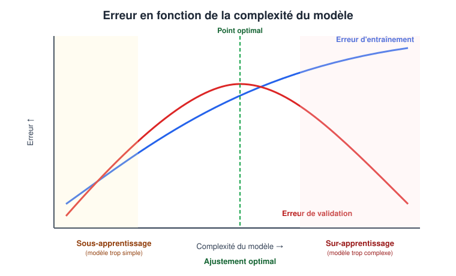
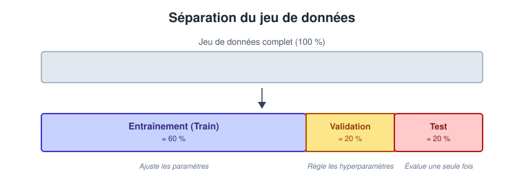

# Fondements Théoriques du Machine Learning

::: {.callout-tip title="Objectifs du chapitre"}
À la fin de ce chapitre, l'étudiant sera capable de :

- **Distinguer** l'apprentissage supervisé et non supervisé ;
- **Utiliser** le vocabulaire fondamental (matrice de design, vecteur cible, hyperparamètres) ;
- **Diagnostiquer** le sur-apprentissage et le sous-apprentissage ;
- **Structurer** correctement un jeu de données (Train/Validation/Test) pour éviter la fuite de données ;
- **Évaluer** l'importance d'une baseline et les limites de certaines métriques.
:::

## 1. Vocabulaire et représentation des données

Avant de choisir un algorithme, il faut formaliser algébriquement le jeu de données. Chaque **ligne** représente une observation et chaque **colonne** une information.

| Terme | Définition | Exemple (Prédiction de prix) |
|---|---|---|
| **Observation** | Un exemple individuel décrit par plusieurs variables | Un appartement particulier |
| **Échantillon** | Un ensemble d'observations représentant une population | 10 000 appartements |
| **Variable explicative (*Feature*)** | Information utilisée par le modèle pour prédire | Surface, quartier |
| **Cible (*Target*)** | La valeur que le modèle doit apprendre à prédire | Prix de vente |
| **Étiquette (*Label*)** | La réponse connue associée à une observation (en classification) | « Vendu rapidement » |

: Notions et vocabulaire {#tbl-jeu-donnees}

**Notation mathématique standard utilisée dans ce cours** :

- $X$ : la **matrice de design** contenant les variables explicatives (une ligne par observation, une colonne par variable) ;
- $y$ : le **vecteur cible** (ou vecteur des étiquettes) ;
- $x_i$ : les variables explicatives de l'observation $i$ (la $i$-ème ligne de $X$) ;
- $y_i$ : la réponse associée à l'observation $i$ (le $i$-ème élément de $y$).

::: {.callout-important title="Exemple"}
Pour le jeu de données ci-dessous (2 appartements, 2 variables explicatives numériques) :

| id | surface ($m^2$) | nbr_chambres | prix (MAD) |
|---:|---:|---:|---:|
| 1 | 65 | 2 | 850 000 |
| 2 | 42 | 1 | 420 000 |

On note $x_1 = (65, 2)$ et $y_1 = 850\,000$ pour la première observation.

Les variables explicatives sont regroupées dans la matrice des caractéristiques $X$ (de dimension $2 \times 2$), et les cibles dans le vecteur-colonne $y$ :

$$X = \begin{pmatrix} 65 & 2 \\ 42 & 1 \end{pmatrix} \quad \text{et} \quad y = \begin{pmatrix} 850\,000 \\ 420\,000 \end{pmatrix}$$
:::

## 2. Les grandes familles d'apprentissage {#sec-familles-apprentissage}

Il existe plusieurs façons de classer les méthodes de Machine Learning. Pour ce cours, la distinction fondamentale repose sur la **nature du signal disponible pour l'apprentissage**.

On retient ici deux **grands paradigmes**, étudiés dans les chapitres suivants :

* **l'apprentissage supervisé** ;
* **l'apprentissage non supervisé** ;

:::: {.panel-tabset}

## Supervisé

Le modèle apprend à partir de données **étiquetées** : chaque exemple d'entraînement est associé à une **cible** $y$ que le modèle cherche à prédire à partir des données d'entrée $X$.

Les deux principales tâches sont :

* **Régression** : la cible $y$ est une valeur numérique, généralement continue.

  *Exemple : prédire le prix d'un logement.*

* **Classification** : la cible $y$ appartient à un ensemble de classes.

  *Exemple : déterminer si une transaction est frauduleuse ou non.*

Pendant l'entraînement, le modèle dispose donc d'exemples de la forme :

$$
(X, y)
$$

et cherche à apprendre une relation permettant de produire une prédiction $\hat{y}$ à partir d'une nouvelle entrée $X$.

## Non supervisé

Le modèle apprend à partir de données **non étiquetées**, c'est-à-dire sans cible $y$ fournie à l'avance.

L'objectif est de mettre en évidence des **structures, régularités, relations ou regroupements** présents dans les données.

Parmi les tâches courantes :

* **Clustering** : regrouper les observations selon leur similarité ;
* **Réduction de dimension** : représenter les données dans un espace de dimension plus faible ;
* **Détection d'anomalies** : identifier des observations qui s'écartent du comportement habituel.

*Exemple : regrouper des clients selon leur comportement d'achat sans disposer de catégories prédéfinies.*

On dispose principalement des données $X$ sans cible $y$ fournie pour l'apprentissage.

::::

::: {.callout-tip title="À retenir"}
La question à se poser pour choisir un paradigme est toujours la même : **de quelles données est-ce que je dispose ?** Ai-je une cible connue pour chaque observation (supervisé) ou dois-je rechercher une structure sans cible fournie (non supervisé) ?
:::

::: {.callout-note title="Périmètre du cours"}
Le présent cours se concentrera sur une sélection d'algorithmes fondamentaux issus de l'**apprentissage supervisé** et de l'**apprentissage non supervisé**. L'apprentissage par renforcement et les approches semi-supervisées seront seulement mentionnés, car ils dépassent l'objectif de cette introduction.
:::

## 3. Apprendre et généraliser {#sec-generalisation}

> Le meilleur modèle n'est pas celui qui mémorise le mieux les données d'entraînement,
> mais celui qui **généralise** le mieux à des données inédites.
>
> --- Principe fondamental du Machine Learning

La **généralisation** est la capacité du modèle à produire une prédiction correcte face à une observation qu'il n'a jamais rencontrée. L'état d'un modèle se classe dans l'une de ces trois situations :

1. **Sous-apprentissage (*Underfitting*)** : modèle trop simple. Incapable de capturer la structure des données. Performances médiocres partout - y compris sur les données d'entraînement.
2. **Ajustement optimal (*Good fit*)** : le modèle extrait les règles générales (le **signal**) et ignore les anomalies (le **bruit**).
3. **Sur-apprentissage (*Overfitting*)** : modèle trop complexe. Il mémorise le bruit spécifique aux données d'entraînement. Il excelle artificiellement sur l'historique mais échoue sur de nouvelles données.

{#fig-overfitting}

La @fig-overfitting illustre le compromis entre un modèle trop simple et un modèle trop complexe. L'objectif est de choisir une complexité pour laquelle l'erreur sur des données nouvelles est faible. Le vocabulaire biais-variance pourra être approfondi plus tard ; ici, il suffit de retenir que mémoriser les données d'entraînement ne garantit pas une bonne généralisation.

::: {.callout-note title="Comment détecter concrètement un sur-apprentissage ?" collapse="true"}
Le signal le plus caractéristique est un **grand écart entre la performance sur le jeu d'entraînement et sur le jeu de validation** : une accuracy de 99 % en entraînement contre 65 % en validation est une signature typique de sur-apprentissage. À l'inverse, une accuracy médiocre et similaire sur les deux jeux (par exemple 55 % partout) évoque plutôt un sous-apprentissage.
:::

## 4. Jeux d'évaluation et Fuite de données {#sec-jeux-evaluation}

Pour diagnostiquer la généralisation, on divise l'échantillon initial en **trois sous-ensembles disjoints** :

| Jeu de données | Rôle |
|---|---|
| **Entraînement (*Train*)** | Ajuster les paramètres internes du modèle. |
| **Validation** | Comparer différents modèles et régler les hyperparamètres. |
| **Test** | Estimer la performance finale sur des données strictement inédites. |

: Les jeux d'évaluation {#tbl-jeux-evaluation}

{#fig-train-val-test}

::: {.callout-warning title="Règle d'or"}
Le jeu de **Test** ne doit être utilisé **qu'une seule fois**, tout à la fin du projet, pour obtenir une estimation honnête de la performance. Le consulter à répétition pour ajuster des choix de modélisation revient, de fait, à l'intégrer au jeu d'entraînement - et fausse l'estimation finale.
:::

### 4.1. Le cas particulier des données temporelles

Lorsque les observations sont **datées** (ex. transactions bancaires, ventes mensuelles), un découpage **aléatoire** de Train/Validation/Test est dangereux : le modèle pourrait apprendre à partir d'informations « futures » par rapport à certaines observations de test, ce qui **surestime artificiellement** sa performance réelle. Dans ce cas, on applique plutôt un **découpage chronologique** : les données les plus anciennes forment le jeu d'entraînement, les plus récentes le jeu de test - reproduisant ainsi la situation réelle où le modèle doit prédire l'avenir à partir du passé.

### 4.2. La fuite de données (*Data Leakage*) {#sec-fuite-donnees}

Il y a **fuite de données** lorsqu'une information qui ne devrait pas être disponible au moment de la prédiction influence malgré tout l'entraînement. Cela génère des performances artificiellement excellentes, qui s'effondrent en production.

*Exemples caractéristiques :*

- Normaliser (centrer-réduire) **l'ensemble** du jeu de données *avant* de le séparer en Train/Test : les statistiques de normalisation (moyenne, écart-type) « voient » alors des données de test.
- Inclure une variable qui n'est calculée ou connue **qu'après** l'événement à prédire (ex. la date d'une consultation médicale future pour prédire une réadmission hospitalière).

Pour éviter ce type d'erreur, on utilise des **Pipelines** : des enchaînements d'étapes (normalisation, encodage, modélisation) que l'on ajuste **uniquement** sur le jeu d'entraînement, puis que l'on applique tel quel aux jeux de validation et de test.

## 5. Paramètres et Hyperparamètres {#sec-parametres-hyperparametres}

| Élément | Qui le fixe ? | Exemple |
|---|---|---|
| **Paramètre** | Le modèle l'apprend automatiquement à partir des données | Coefficients d'une régression linéaire |
| **Hyperparamètre** | Le développeur le règle avant l'entraînement | Profondeur maximale d'un arbre de décision |

: Paramètres et hyperparamètres {#tbl-parametres}

::: {.callout-tip title="Comment choisir un hyperparamètre sans tricher ?"}
On ne règle **jamais** un hyperparamètre en observant sa performance sur le jeu de **test** - cela reviendrait à une fuite de données (voir @sec-fuite-donnees). La bonne pratique consiste à comparer plusieurs valeurs d'hyperparamètres uniquement sur le jeu de **validation** (@tbl-jeux-evaluation), et à ne consulter le jeu de test qu'une fois le meilleur réglage définitivement choisi.
:::

## 6. La Baseline et les limites de l'Accuracy {#sec-baseline-accuracy}

Une **baseline** est une règle de décision extrêmement simple (ex. « toujours prédire la classe majoritaire »). Elle répond à la question : *le modèle ML complexe fait-il réellement mieux que l'approche la plus basique possible ?*

::: {.callout-caution title="Le piège des classes déséquilibrées"}
Si 99 % des transactions sont légitimes et 1 % sont des fraudes, une baseline qui prédit systématiquement « Légitime » obtiendra **99 % d'*accuracy*** (exactitude) - un score en apparence excellent - alors même que le modèle est totalement inutile, puisqu'il ne détecte jamais aucune fraude.
:::

Pour étudier plus finement les erreurs d'un modèle de classification, on utilise notamment la **matrice de confusion**, qui sera définie et étudiée dans le chapitre consacré à la classification.

## 7. Prédiction, Corrélation et Causalité {#sec-correlation-causalite}

Un modèle ML excelle à trouver des **corrélations** (ex. les ventes de glaces et les coups de soleil augmentent ensemble l'été). Cependant :

- La **prédiction** exploite une corrélation pour estimer une valeur inconnue.
- La **causalité** prouve qu'agir sur A modifie effectivement B.

Un bon modèle prédictif **ne justifie pas** une décision causale : arrêter de vendre des glaces ne réduira évidemment pas le nombre de coups de soleil, car la vraie cause commune des deux phénomènes est... le beau temps.

::: {.callout-warning title="Remarque"}
Avant de transformer une corrélation détectée par un modèle en **décision d'action** (« si on fait X, alors Y va s'améliorer »), il faut se demander s'il n'existe pas une **variable cachée** expliquant conjointement les deux phénomènes observés.
:::

## 8. Enjeux Éthiques et Reproductibilité

**L'éthique dans le ML :**

- **Biais de représentation** : les données d'entraînement reflètent-elles fidèlement la population sur laquelle le modèle sera utilisé, ou risquent-elles de discriminer certains groupes ?
- **Explicabilité** : peut-on justifier, a posteriori, la décision prise par la machine - en particulier lorsque celle-ci affecte directement une personne (crédit refusé, diagnostic médical) ?

**La Reproductibilité :** un résultat scientifique ou industriel doit pouvoir être relancé à l'identique par une autre personne. Pratiques obligatoires :

1. Figer les versions des bibliothèques utilisées (`uv.lock`, voir le chapitre d'introduction).
2. Fixer les « graines aléatoires » (*random seeds*) de tous les processus stochastiques.
3. Versionner le code (Git) et documenter précisément la pipeline de données.

:::{.content-visible when-profile="teacher"}
::: {.callout-note title="Auto-évaluation" collapse="true"}
- [ ] Je sais définir $X$ et $y$ pour un jeu de données que je choisis moi-même.
- [ ] Je peux distinguer l'apprentissage supervisé et non supervisé et donner un exemple pour chacun.
- [ ] Je sais expliquer, à partir d'un graphique d'erreurs, si un modèle sous-apprend ou sur-apprend.
- [ ] Je sais pourquoi on ne doit jamais régler un hyperparamètre sur le jeu de test.
- [ ] Je comprends pourquoi l'accuracy seule peut être trompeuse lorsque les classes sont déséquilibrées.
:::
:::

## Exercices

::: {#exr-fond-1}

On dispose du tableau suivant, pour la tâche « prédire si un appartement sera vendu rapidement » :

| id | surface | quartier | prix | vendu_rapidement |
|---:|---:|---|---:|---|
| 1 | 65 | Centre | 850000 | oui |
| 2 | 42 | Nord | 420000 | non |
| 3 | 80 | Centre | 990000 | oui |

1. Qu'est-ce qu'une observation, ici ?
2. Quel est l'échantillon ?
3. Quelles sont les variables explicatives ?
4. Quelle est la cible ?
5. Quel est le rôle de la colonne `id` ?
:::

:::{.content-visible when-profile="teacher"}
::: {.callout-tip collapse="true" title="Solution de l'exercice @exr-fond-1"}
1. Une observation est une ligne du tableau, ici un appartement particulier (ex. l'appartement n°1).
2. L'échantillon est l'ensemble des 3 appartements du tableau.
3. Les variables explicatives sont `surface`, `quartier` et `prix` (toute information utilisée pour prédire).
4. La cible est `vendu_rapidement` (« oui »/« non »), c'est ce que le modèle doit apprendre à prédire.
5. La colonne `id` n'est **ni** une variable explicative **ni** une cible : c'est un simple identifiant, qui ne doit **pas** être fourni au modèle (il n'apporte aucune information prédictive et pourrait même provoquer une fuite si les identifiants étaient attribués dans l'ordre chronologique de vente).
:::
:::

::: {#exr-fond-2}

Deux modèles donnent les résultats suivants :

| Modèle | Accuracy train | Accuracy test |
|---|---:|---:|
| A | 99 % | 61 % |
| B | 84 % | 81 % |

1. Quel modèle généralise le mieux ?
2. Quel modèle semble en sur-apprentissage ?
3. Pourquoi ne faut-il pas choisir le modèle A en regardant uniquement l'accuracy d'entraînement ?
:::

:::{.content-visible when-profile="teacher"}
::: {.callout-tip collapse="true" title="Solution de l'exercice @exr-fond-2"}
1. Le **modèle B** généralise le mieux : son accuracy de test (81 %) est nettement supérieure à celle du modèle A (61 %), et l'écart train/test y est faible.
2. Le **modèle A** est en sur-apprentissage : l'écart de 38 points entre train (99 %) et test (61 %) est la signature typique décrite en @fig-overfitting - le modèle a mémorisé le bruit des données d'entraînement.
3. L'accuracy d'entraînement seule ne mesure **jamais** la capacité de généralisation : un modèle peut atteindre 100 % sur ses données d'entraînement en les mémorisant purement, tout en étant inutilisable sur de nouvelles données.
:::
:::

::: {#exr-fond-3}

Pour prédire si un patient sera réadmis dans les 30 jours suivant sa sortie, une équipe utilise :

- l'âge ;
- le diagnostic initial ;
- la durée d'hospitalisation ;
- **la date de la prochaine consultation** ;
- le nombre de médicaments prescrits pendant le séjour.

1. Quelle variable est potentiellement une fuite de données ?
2. Pourquoi ?
:::

:::{.content-visible when-profile="teacher"}
::: {.callout-tip collapse="true" title="Solution de l'exercice @exr-fond-3"}
1. La **date de la prochaine consultation** est potentiellement une fuite.
2. Cette information n'est généralement connue **qu'après** la sortie du patient (voire seulement si une réadmission ou un suivi a déjà été planifié) - elle n'est donc pas disponible au moment réel où l'on voudrait faire la prédiction, ce qui correspond exactement à la définition de la fuite de données donnée en @sec-fuite-donnees.
:::
:::

::: {#exr-fond-4}

Pour chacun des éléments suivants, indiquez s'il s'agit d'un **paramètre** appris ou d'un **hyperparamètre** choisi par le développeur :

1. les coefficients d'une régression linéaire ;
2. le nombre maximal de niveaux d'un arbre de décision ;
3. le nombre de voisins $k$ dans l'algorithme des k plus proches voisins.
:::

:::{.content-visible when-profile="teacher"}
::: {.callout-tip collapse="true" title="Solution de l'exercice @exr-fond-4"}
D'après la @tbl-parametres :

1. **Paramètre** - les coefficients sont appris automatiquement par l'algorithme à partir des données.
2. **Hyperparamètre** - la profondeur maximale est un choix fait par le développeur avant l'entraînement.
3. **Hyperparamètre** - la valeur de $k$ est fixée avant l'entraînement (et se règle typiquement sur le jeu de validation, jamais sur le test).
:::
:::

::: {#exr-fond-5}

Dans un jeu de classification de 1 000 observations, la classe A représente 900 observations et la classe B seulement 100.

1. Quelle accuracy obtient la baseline qui prédit toujours A ?
2. Pourquoi cette baseline peut-elle être utile malgré sa simplicité ?
3. Pourquoi faut-il compléter l'accuracy par d'autres mesures lorsque la classe B est minoritaire ?
:::

:::{.content-visible when-profile="teacher"}
::: {.callout-tip collapse="true" title="Solution de l'exercice @exr-fond-5"}
1. La baseline obtient **90 % d'accuracy** (900 bonnes prédictions sur 1 000), sans avoir rien appris.
2. Elle est utile car elle fixe un **seuil minimal** que tout modèle plus sophistiqué doit impérativement dépasser pour être considéré comme réellement utile (voir le « piège des classes déséquilibrées », @sec-baseline-accuracy).
3. L'accuracy globale peut rester élevée même si le modèle détecte très peu de cas de la classe B. Il faut donc utiliser des mesures adaptées aux erreurs sur cette classe ; ces mesures seront définies dans le chapitre consacré à la classification.
:::
:::

::: {#exr-fond-6}

Une banque utilise un modèle pour repérer des demandes de prêt potentiellement frauduleuses. Les fraudes sont rares, mais manquer une fraude peut coûter très cher.

1. Pourquoi l'accuracy seule risque-t-elle d'être insuffisante ?
2. Pourquoi faut-il discuter avec le métier avant de choisir une métrique ?
3. Dans quel chapitre trouvera-t-on les outils permettant de détailler les erreurs positives et négatives ?
:::

:::{.content-visible when-profile="teacher"}
::: {.callout-tip collapse="true" title="Solution de l'exercice @exr-fond-6"}
1. Si les fraudes sont rares, un modèle qui prédit presque toujours « non fraude » peut obtenir une accuracy élevée tout en étant inutile.
2. Le choix dépend du coût relatif des erreurs : manquer une fraude et contrôler à tort une demande légitime n'ont pas nécessairement les mêmes conséquences.
3. Les outils d'analyse détaillée seront présentés dans le chapitre consacré à la classification.
:::
:::

::: {#exr-fond-7}

Une analyse montre que les personnes qui utilisent davantage une application de e-learning réussissent mieux une formation. L'équipe pédagogique conclut que rendre l'application obligatoire fera automatiquement réussir davantage d'étudiants.

1. Quelle est la corrélation observée ?
2. Pourquoi cette conclusion causale peut-elle être injustifiée ?
:::

:::{.content-visible when-profile="teacher"}
::: {.callout-tip collapse="true" title="Solution de l'exercice @exr-fond-7"}
1. La corrélation observée est entre **le niveau d'utilisation de l'application** et **la réussite à la formation**.
2. Comme expliqué en @sec-correlation-causalite, une corrélation ne prouve pas une causalité : il est possible qu'une **variable cachée** - par exemple la motivation intrinsèque des étudiants - explique à la fois une utilisation plus fréquente de l'application **et** de meilleurs résultats, sans que l'application elle-même soit la cause de la réussite. Rendre l'application obligatoire pourrait donc n'avoir aucun effet sur les étudiants peu motivés.
:::
:::

::: {#exr-fond-8}

Pour chaque situation, indiquez si elle relève plutôt de l'apprentissage supervisé ou non supervisé, et justifiez brièvement.

1. Prédire le prix d'un logement à partir de sa surface et de son quartier.
2. Regrouper des clients selon leurs habitudes d'achat sans catégorie connue à l'avance.
3. Déterminer si un e-mail est un spam à partir d'e-mails déjà étiquetés.
:::

:::{.content-visible when-profile="teacher"}
::: {.callout-tip collapse="true" title="Solution de l'exercice @exr-fond-8"}
1. **Supervisé** : le prix connu dans les exemples d'apprentissage sert de cible.
2. **Non supervisé** : aucune catégorie n'est fournie ; l'algorithme recherche des groupes.
3. **Supervisé** : chaque e-mail d'apprentissage possède une étiquette (« spam » ou « non-spam »).
:::
:::
