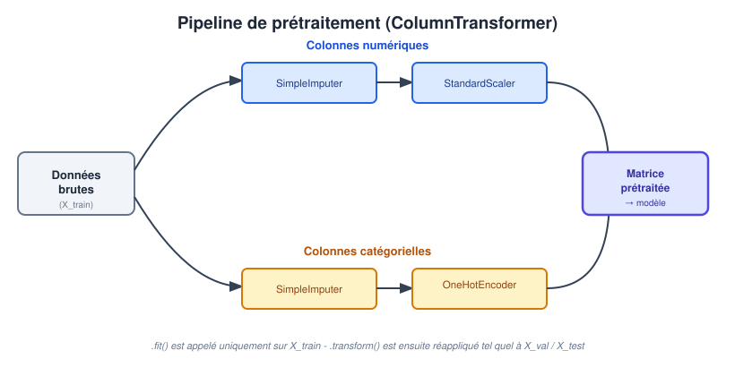

# Collecte et Prétraitement des Données

::: {.callout-tip title="Objectifs du chapitre"}
À la fin de ce chapitre, l'étudiant sera capable de :

- **Identifier** les principales stratégies de collecte de données (bases de données, *web scraping*, API) ;
- **Comprendre** l'importance de la représentativité d'un échantillon ;
- **Expliquer** la notion d'encodage des variables et pourquoi elle est indispensable ;
- **Appliquer** les techniques de nettoyage, d'encodage et de mise à l'échelle des données ;
- **Construire** un pipeline de prétraitement simple avec Scikit-Learn.
:::

> Si les données sont de mauvaise qualité, corrompues ou biaisées, les résultats produits par le modèle seront tout aussi défectueux, quelle que soit la sophistication de l'algorithme (*Garbage In, Garbage Out*).
>
> --- Principe fondamental de la Data Science


Un modèle de Machine Learning, aussi sophistiqué soit-il, ne peut produire des prédictions fiables qu'à partir de données de qualité. En effet, aucune finesse algorithmique ne peut compenser des données mal collectées, non représentatives ou mal préparées. Ce chapitre couvre l'ensemble du travail qui précède la modélisation à proprement parler (@fig-cycle-vie-ml du chapitre 1, étapes 2 et 3) : où trouver les données, comment s'assurer qu'elles sont représentatives, puis comment les nettoyer, les encoder et les mettre à l'échelle avant de les transmettre à un algorithme.

## 1. Stratégies de collecte de données

Avant tout projet, il faut identifier la ou les sources permettant de constituer le jeu de données $X, y$ introduit au chapitre précédent. Trois grandes familles de sources coexistent dans la pratique professionnelle.

### 1.1. Les bases de données

La source la plus courante en entreprise reste la base de données interne, qu'elle soit :

- **relationnelle (SQL)** : les données sont organisées en tables reliées par des clés (ex. PostgreSQL, MySQL) et interrogées via le langage **SQL** (*Structured Query Language*) ;
- **non-relationnelle (NoSQL)** : les données sont stockées sous une forme plus flexible — documents JSON (MongoDB), paires clé-valeur (Redis), ou graphes (Neo4j) — adaptée aux données peu structurées ou à très grande échelle.


### 1.2. Le *web scraping*

Lorsque les données ne sont disponibles que sur des pages web, on a recours au **web scraping** : l'extraction automatisée d'informations à partir du code HTML de sites web. Les bibliothèques Python de référence sont :

- **`BeautifulSoup`** : idéale pour analyser (*parser*) le HTML d'une page unique et en extraire des éléments ciblés (balises, attributs) ;
- **`Scrapy`** : un *framework* complet, conçu pour des collectes à grande échelle sur de nombreuses pages, avec gestion native de la pagination, des files d'attente de requêtes et de l'exportation des résultats.

::: {.callout-warning title="Éthique du web scraping"}
Le *web scraping* n'est pas toujours autorisé. Avant de collecter des données sur un site, il convient de vérifier :

- le fichier `robots.txt` du site, qui précise les zones autorisées ou interdites aux robots ;
- les conditions générales d'utilisation (CGU) du site, qui peuvent explicitement interdire la collecte automatisée ;
- le cadre réglementaire applicable à la protection des données personnelles (ex. loi marocaine 09-08, ou RGPD pour les données concernant des ressortissants européens), en particulier si des données à caractère personnel sont collectées.
:::

### 1.3. Les API

Une **API** (*Application Programming Interface*) est une interface mise à disposition par un fournisseur de données, qui permet d'obtenir des données structurées de façon normalisée — sans avoir à analyser du HTML. On distingue notamment :

- les **API REST**, les plus répandues, où chaque ressource est accessible via une URL et une méthode HTTP (`GET`, `POST`...), avec une réponse généralement au format JSON ;
- les **API GraphQL**, plus récentes, qui permettent au client de préciser exactement les champs qu'il souhaite récupérer en une seule requête, réduisant ainsi le volume de données transférées inutilement.

| Source | Exemple |
|---|---|
| Bases de données | SQL (PostgreSQL, MySQL), NoSQL (MongoDB) |
| Web Scraping | `BeautifulSoup`, `Scrapy` |
| APIs | REST, GraphQL |

: Sources de données courantes {#tbl-sources-donnees}


## 2. Représentativité et biais statistiques

Collecter des données ne suffit pas : encore faut-il qu'elles soient **représentatives** de la population sur laquelle le modèle sera utilisé en production. Un échantillon est représentatif lorsque sa distribution reflète fidèlement celle de la population cible.

::: {.callout-important title="À retenir"}
Un échantillon non représentatif introduit un **biais** qui se propage à toutes les étapes du modèle, même si l'algorithme est parfaitement implémenté. Aucune technique de modélisation, aussi avancée soit-elle, ne peut corriger un biais présent dès la collecte des données.
:::

On distingue notamment trois types de biais fréquents en pratique :

- **Biais de sélection** : l'échantillon collecté ne couvre pas correctement certains sous-groupes de la population (ex. un sondage de satisfaction réalisé uniquement auprès des clients ayant un compte en ligne exclut de fait les clients moins digitalisés).
- **Biais de couverture temporelle** : les données ne couvrent qu'une période particulière, non représentative du comportement général (ex. collecter des données de vente uniquement pendant une période de soldes).
- **Biais de mesure** : l'instrument ou le protocole de collecte lui-même déforme la donnée (ex. un capteur mal calibré, un formulaire dont la formulation oriente la réponse).

::: {.callout-note title="Exemple historique classique" collapse="true"}
Lors de l'élection présidentielle américaine de 1936, le magazine *Literary Digest* prédit, sur la base de plus de 2 millions de réponses à un sondage, la victoire du candidat Alf Landon. Le sondage fut envoyé par la poste à partir de listes d'abonnés au téléphone et de propriétaires de voitures — une population nettement plus aisée que la moyenne en pleine Grande Dépression. Malgré une taille d'échantillon considérable, le sondage souffrait d'un **biais de sélection** majeur, et la prédiction se révéla fausse : Franklin D. Roosevelt fut réélu avec une large majorité. Cet exemple illustre qu'un grand échantillon **non représentatif** reste moins fiable qu'un échantillon plus petit mais correctement constitué.
:::

## 3. Nettoyage des données

Une fois les données collectées, il est rare qu'elles soient directement exploitables : valeurs manquantes, doublons, incohérences et valeurs aberrantes sont la norme plutôt que l'exception.

### 3.1. Les valeurs manquantes

Une valeur manquante peut avoir des origines très différentes, ce qui conditionne la stratégie à adopter :

- **MCAR** (*Missing Completely At Random*) : l'absence de la valeur ne dépend d'aucune variable, observée ou non (ex. un bug technique aléatoire lors de l'enregistrement).
- **MAR** (*Missing At Random*) : l'absence dépend d'une autre variable observée (ex. les hommes répondent moins souvent à une question sur le poids, mais indépendamment du poids lui-même).
- **MNAR** (*Missing Not At Random*) : l'absence dépend de la valeur manquante elle-même (ex. les personnes aux revenus les plus élevés refusent plus souvent de déclarer leur revenu).

::: {.callout-warning title="Remarque"}
Le cas **MNAR** est le plus problématique : ignorer ou imputer naïvement ces valeurs manquantes peut introduire un biais systématique difficile à corriger, car l'absence de la donnée est elle-même porteuse d'information.
:::

**Stratégies de traitement des valeurs manquantes :**

| Stratégie | Principe | Limite |
|---|---|---|
| Suppression des lignes | Retirer toute observation comportant une valeur manquante | Perte d'information, biaise l'échantillon si les valeurs manquent de façon non aléatoire |
| Imputation simple | Remplacer par la moyenne, la médiane (numérique) ou le mode (catégoriel) | Réduit artificiellement la variance de la variable |

: Stratégies d'imputation des valeurs manquantes {#tbl-imputation}

::: {.callout-tip title="Règle d'or"}
Pour éviter la fuite de données (*data leakage*), la stratégie d'imputation (moyenne, médiane...) doit être **calculée uniquement sur le jeu d'entraînement**, puis appliquée telle quelle aux jeux de validation et de test — sous peine de fuite de données (notion introduite dans le chapitre précédent, §4.2).
:::

### 3.2. Les valeurs aberrantes (*outliers*)

Une valeur aberrante est une observation qui s'écarte fortement du comportement général des données — parfois une erreur de saisie, parfois une observation légitime mais extrême. Deux méthodes de détection sont couramment enseignées :

- **La méthode de l'écart interquartile (IQR)** : toute valeur en dehors de l'intervalle $[Q_1 - 1{,}5 \times IQR,\ Q_3 + 1{,}5 \times IQR]$ est considérée comme aberrante, où $IQR = Q_3 - Q_1$.
- **Le score-z** : toute valeur dont le score $z = \dfrac{x - \mu}{\sigma}$ dépasse un seuil (souvent $|z| > 3$) est considérée comme aberrante ; cette méthode suppose implicitement une distribution proche de la loi normale.

::: {.callout-caution title="Une valeur aberrante n'est pas toujours une erreur"}
Avant de supprimer systématiquement les valeurs aberrantes détectées, il faut se demander si elles reflètent une erreur de mesure (à corriger ou supprimer) ou un phénomène réel mais rare (par exemple, un très gros client dans une base de transactions commerciales) — auquel cas leur suppression pourrait faire perdre au modèle une information précieuse.
:::

### 3.3. Les doublons

Un doublon (deux lignes strictement identiques, ou identiques sur les variables clés) doit généralement être supprimé, car il donne artificiellement plus de poids à une observation dans l'apprentissage — un risque de biais parfois qualifié de « double comptage ».

## 4. Encodage des variables catégorielles

La quasi-totalité des algorithmes de Machine Learning (dont l'ensemble de ceux étudiés dans ce cours) reposent sur des opérations **mathématiques** — distances, produits scalaires, sommes pondérées — qui ne peuvent s'appliquer qu'à des **nombres**. Or de nombreuses variables sont, par nature, catégorielles (un quartier, une couleur, une catégorie socio-professionnelle). L'**encodage** désigne l'ensemble des techniques permettant de transformer ces variables catégorielles en une représentation numérique exploitable par un algorithme, **sans dénaturer l'information** qu'elles portent.

### 4.1. Encodage ordinal (*Ordinal Encoding*)

Chaque catégorie est remplacée par un entier (0, 1, 2...). Cette méthode est adaptée **uniquement** aux variables **ordinales**, c'est-à-dire dont les catégories possèdent un ordre naturel (ex. `Faible` < `Moyen` < `Élevé`). Dans Scikit-Learn, on utilise `OrdinalEncoder` pour les variables explicatives ; `LabelEncoder` est plutôt réservé à la variable cible.

::: {.callout-warning title="Piège fréquent"}
Appliquer un encodage ordinal à une variable **nominale** (sans ordre naturel, ex. `quartier` : Centre, Nord, Sud) introduit un ordre artificiel que l'algorithme interprétera à tort comme porteur de sens (il pourrait, par exemple, en déduire que `Sud` (codé 2) est « plus grand » que `Centre` (codé 0), ce qui n'a aucune signification réelle).
:::

### 4.2. Encodage One-Hot (*One-Hot Encoding*)

Pour les variables **nominales**, on utilise plutôt l'encodage *one-hot* : chaque catégorie devient une **nouvelle colonne binaire** (0 ou 1), sans introduire d'ordre artificiel.

Par exemple, la variable `quartier` (Centre, Nord, Sud) devient :

| quartier_Centre | quartier_Nord | quartier_Sud |
|:---:|:---:|:---:|
| 1 | 0 | 0 |
| 0 | 1 | 0 |
| 0 | 0 | 1 |

: Encodage One-Hot de la variable `quartier` {#tbl-one-hot}

::: {.callout-note title="Le piège de la variable factice (Dummy Variable Trap)" collapse="true"}
Lorsqu'une variable comporte $k$ catégories, il suffit en réalité de $k-1$ colonnes binaires pour représenter toute l'information : la dernière catégorie est déductible des autres (si `quartier_Centre = 0` et `quartier_Nord = 0`, alors nécessairement `quartier_Sud = 1`). Conserver les $k$ colonnes introduit une redondance parfaite entre variables (colinéarité), problématique pour certains algorithmes comme la régression linéaire (chapitre 3). L'argument `drop='first'` de `OneHotEncoder` permet de supprimer automatiquement cette colonne redondante.
:::

### 4.3. Choisir une méthode simple

| Méthode | Adaptée à | Nombre de colonnes créées |
|---|---|---|
| Ordinal Encoding | Variables **ordinales** | 1 (inchangé) |
| One-Hot Encoding | Variables **nominales**, peu de catégories | $k$ (ou $k-1$) |

: Comparaison des principales méthodes d'encodage {#tbl-encodage}

Dans ce cours, on privilégie donc deux solutions faciles à vérifier : l'encodage ordinal pour les catégories ordonnées et l'encodage one-hot pour les catégories nominales. Les encodages destinés aux variables comportant un très grand nombre de catégories seront étudiés seulement dans un cours plus avancé.

## 5. Mise à l'échelle : Standardisation vs Normalisation

De nombreux algorithmes — en particulier ceux fondés sur une notion de **distance** entre observations (k plus proches voisins, K-means, chapitre 5) ou sur une **descente de gradient** (régression linéaire, réseaux de neurones) — sont sensibles à l'échelle des variables. Une variable exprimée en milliers de dirhams (ex. un prix) dominera artificiellement une variable exprimée en unités (ex. un nombre de pièces), même si cette dernière est tout aussi pertinente.

### 5.1. La standardisation (*Z-score scaling*)

La **standardisation** centre chaque variable autour d'une moyenne de 0 avec un écart-type de 1 :

$$
x' = \frac{x - \mu}{\sigma}
$$ {#eq-standardisation}

où $\mu$ est la moyenne et $\sigma$ l'écart-type de la variable, **calculés sur le jeu d'entraînement uniquement**.

### 5.2. La normalisation (*Min-Max scaling*)

La **normalisation** ramène chaque variable dans un intervalle fixe, généralement $[0, 1]$ :

$$
x' = \frac{x - x_{min}}{x_{max} - x_{min}}
$$ {#eq-normalisation}

### 5.3. Quand utiliser l'une ou l'autre ?

| Critère | Standardisation (@eq-standardisation) | Normalisation (@eq-normalisation) |
|---|---|---|
| Sensibilité aux valeurs aberrantes | Modérée | Élevée (les valeurs extrêmes déterminent $x_{min}$/$x_{max}$) |
| Hypothèse sur la distribution | Aucune (mais adaptée aux distributions proches de la normale) | Aucune |
| Intervalle de sortie | Non borné (généralement $[-3, 3]$ environ) | Borné, $[0, 1]$ |
| Cas d'usage typique | Algorithmes basés sur le gradient, PCA, régression | Réseaux de neurones (fonctions d'activation bornées), image (pixels) |

: Choix entre standardisation et normalisation {#tbl-scaling}

Le choix entre la @eq-standardisation et la @eq-normalisation dépend donc de l'algorithme cible et de l'échelle des variables. En présence d'*outliers* marqués, il faut d'abord vérifier s'ils sont des erreurs ou des observations réelles avant de choisir une transformation.

::: {.callout-warning title="Règle d'or (rappel du chapitre précédent)"}
Comme pour l'imputation (@tbl-imputation), les paramètres de mise à l'échelle ($\mu$, $\sigma$, $x_{min}$, $x_{max}$) doivent être **estimés uniquement sur le jeu d'entraînement** (méthode `.fit()`), puis appliqués tels quels aux jeux de validation et de test (méthode `.transform()`) — toute autre pratique constitue une fuite de données.
:::

## 6. Construire un pipeline de prétraitement avec les outils modernes de Python

En pratique, un même jeu de données combine généralement des variables numériques et catégorielles, chacune nécessitant un traitement distinct. Les bibliothèques modernes de l'écosystème Python permettent d'**enchaîner et d'automatiser** l'ensemble de ces étapes, plutôt que de les appliquer manuellement une à une.

### 6.1. `ColumnTransformer` et `Pipeline` de Scikit-Learn

Scikit-Learn propose deux briques complémentaires pour construire un prétraitement reproductible et sans fuite de données :

- **`Pipeline`** : enchaîne plusieurs transformations (par ex. imputation puis mise à l'échelle) appliquées **à toutes** les colonnes d'un même sous-ensemble ;
- **`ColumnTransformer`** : applique des `Pipeline` **différents** selon le type de colonne (numérique ou catégorielle), puis **fusionne** les résultats en une seule matrice.

{#fig-pipeline}

La @fig-pipeline illustre cette architecture : les colonnes numériques suivent une chaîne `SimpleImputer` → `StandardScaler`, tandis que les colonnes catégorielles suivent une chaîne `SimpleImputer` → `OneHotEncoder`, avant que les deux résultats ne soient recombinés en une seule matrice, transmise au modèle.

```python
from sklearn.compose import ColumnTransformer
from sklearn.pipeline import Pipeline
from sklearn.impute import SimpleImputer
from sklearn.preprocessing import StandardScaler, OneHotEncoder

colonnes_numeriques = ["surface", "nb_pieces"]
colonnes_categorielles = ["quartier"]

pipeline_numerique = Pipeline([
    ("imputation", SimpleImputer(strategy="median")),
    ("mise_a_l_echelle", StandardScaler()),
])

pipeline_categorielle = Pipeline([
    ("imputation", SimpleImputer(strategy="most_frequent")),
    ("encodage", OneHotEncoder(drop="first", handle_unknown="ignore")),
])

pretraitement = ColumnTransformer([
    ("num", pipeline_numerique, colonnes_numeriques),
    ("cat", pipeline_categorielle, colonnes_categorielles),
])

# Fit UNIQUEMENT sur les données d'entraînement (voir §5.3 et le chapitre précédent, §4.2)
X_train_pret = pretraitement.fit_transform(X_train)
# Le même prétraitement, déjà appris, est simplement réappliqué :
X_test_pret = pretraitement.transform(X_test)
```

::: {.callout-tip title="Fonctionnalité récente : sortie en DataFrame"}
Depuis les versions récentes de Scikit-Learn, l'appel `pretraitement.set_output(transform="pandas")` permet d'obtenir directement un `DataFrame` `pandas` en sortie du pipeline (avec des noms de colonnes explicites comme `num__surface` ou `cat__quartier_Nord`), plutôt qu'un simple tableau `numpy` sans noms — un gain de lisibilité appréciable lors du diagnostic d'un pipeline.
:::

### 6.2. Mettre à jour l'environnement du projet

En cohérence avec la gestion de projet introduite au chapitre 1 (§4.3), les nouvelles dépendances nécessaires à ce chapitre sont ajoutées explicitement au projet :

```bash
uv add scikit-learn
uv lock   # fige les versions exactes dans uv.lock, pour la reproductibilité
```

:::{.content-visible when-profile="teacher"}
::: {.callout-note title="Auto-évaluation" collapse="true"}
- [ ] Je sais citer trois sources de données et une bibliothèque Python associée à chacune.
- [ ] Je peux expliquer, avec un exemple, ce qu'est un biais de sélection.
- [ ] Je sais quand utiliser un encodage ordinal plutôt qu'un *One-Hot Encoding*, et pourquoi.
- [ ] Je peux écrire la formule de la standardisation et de la normalisation, et dire dans quel cas privilégier chacune.
- [ ] Je comprends pourquoi un `ColumnTransformer` doit être ajusté (`fit`) uniquement sur le jeu d'entraînement.
:::
:::

## Exercices

::: {.callout-note title="Consigne"}
Ces exercices sont **théoriques** : ils testent votre compréhension des concepts du chapitre, sans nécessiter d'écrire de code. La mise en pratique sur des jeux de données réels avec Scikit-Learn fera l'objet du TP associé à ce chapitre. Les corrigés sont fournis juste après chaque énoncé, dans un bloc repliable.
:::

::: {#exr-pretraitement-1}
### Choisir une source de données

Pour chacun des besoins suivants, indiquez la stratégie de collecte la plus appropriée (base de données, *web scraping*, ou API) et justifiez en une phrase.

a. Récupérer en temps réel le cours de change EUR/MAD.
b. Constituer un historique des prix de l'immobilier à partir d'annonces publiées sur un site sans API publique.
c. Extraire l'historique des commandes déjà stockées dans le système d'information interne de l'entreprise.
:::

:::{.content-visible when-profile="teacher"}
::: {.callout-tip collapse="true" title="Solution de l'exercice @exr-pretraitement-1"}
a. **API** (généralement REST) : les cours de change sont typiquement mis à disposition par des services financiers via une API dédiée, offrant des données structurées et à jour.
b. **Web scraping** : en l'absence d'API publique, l'extraction du HTML des pages d'annonces (avec `BeautifulSoup` ou `Scrapy`) reste la seule option, sous réserve de vérifier le `robots.txt` et les CGU du site (§1.2).
c. **Base de données** : ces données existent déjà, structurées, dans le système d'information de l'entreprise (probablement une base SQL) ; il s'agit alors d'une simple requête, sans collecte externe.
:::
:::

::: {#exr-pretraitement-2}
### Identifier un biais

Une application mobile de course à pied souhaite entraîner un modèle pour prédire le temps qu'un coureur mettra sur un semi-marathon. Les données d'entraînement proviennent exclusivement des utilisateurs ayant activé le partage de leurs statistiques sur les réseaux sociaux.

a. Quel type de biais cette collecte introduit-elle probablement ?
b. Le modèle entraîné sur cet échantillon sera-t-il fiable pour prédire le temps d'un coureur occasionnel qui ne partage jamais ses performances ?
:::

:::{.content-visible when-profile="teacher"}
::: {.callout-tip collapse="true" title="Solution de l'exercice @exr-pretraitement-2"}
a. Un **biais de sélection** (§2) : les coureurs qui partagent volontairement leurs performances sur les réseaux sociaux sont probablement plus performants, plus réguliers ou plus motivés que la population générale des coureurs.
b. Non, probablement pas de façon fiable : le modèle a appris à partir d'une sous-population non représentative de l'ensemble des utilisateurs ; ses prédictions risquent d'être systématiquement trop optimistes pour un coureur occasionnel.
:::
:::

::: {#exr-pretraitement-3}
### Nature d'une valeur manquante

Dans une enquête de satisfaction, on observe que les clients ayant donné une note très basse au service client laissent beaucoup plus souvent la question « Recommanderiez-vous ce service ? » sans réponse que les autres clients.

a. À quelle catégorie (MCAR, MAR, MNAR) ce type d'absence appartient-il le plus probablement ?
b. Pourquoi une imputation simple par le mode (la réponse la plus fréquente) serait-elle risquée dans ce cas précis ?
:::


:::{.content-visible when-profile="teacher"}
::: {.callout-tip collapse="true" title="Solution de l'exercice @exr-pretraitement-3"}
a. **MNAR** (*Missing Not At Random*) est une hypothèse plausible : la probabilité que la réponse soit manquante semble liée à la réponse elle-même (les clients mécontents évitent la question, précisément parce qu'ils seraient enclins à répondre négativement).
b. Une imputation par le mode suppose implicitement que les valeurs manquantes se comportent comme les valeurs observées — ce qui est justement faux dans cette hypothèse MNAR. Remplacer ces absences par la réponse la plus fréquente (probablement positive, si la majorité des clients sont satisfaits) masquerait artificiellement l'insatisfaction réelle des clients n'ayant pas répondu.
:::
:::

::: {#exr-pretraitement-4}
### Choisir un type d'encodage

Pour chacune des variables suivantes, indiquez si un *Label/Ordinal Encoding* ou un *One-Hot Encoding* est le plus adapté, et justifiez.

a. Le niveau de scolarité d'un client : `Primaire`, `Secondaire`, `Supérieur`.
b. La couleur préférée d'un client : `Rouge`, `Bleu`, `Vert`, `Jaune`.
c. Le mois de la transaction (`Janvier`, ..., `Décembre`).
:::

:::{.content-visible when-profile="teacher"}
::: {.callout-tip collapse="true" title="Solution de l'exercice @exr-pretraitement-4"}
a. **Ordinal Encoding** : cette variable possède un ordre naturel non ambigu (`Primaire` < `Secondaire` < `Supérieur`), qu'un encodage ordinal préserve correctement (§4.1).
b. **One-Hot Encoding** : il n'existe aucun ordre naturel entre les couleurs ; un encodage ordinal introduirait un ordre artificiel et trompeur (§4.1, piège fréquent).
c. **Discutable, à justifier** : un encodage ordinal simple (Janvier=1, ..., Décembre=12) fait implicitement l'hypothèse que Décembre et Janvier sont « éloignés », alors qu'ils sont calendairement adjacents (effet de cyclicité) ; un One-Hot Encoding évite ce problème mais perd la notion de proximité entre mois consécutifs. C'est un exemple où ni l'une ni l'autre des deux méthodes vues dans ce chapitre n'est pleinement satisfaisante (des encodages cycliques spécifiques existent, hors du cadre de ce chapitre).
:::
:::

::: {#exr-pretraitement-5}
### Standardisation ou normalisation ?

Un jeu de données contient une variable `revenu_annuel` dont la quasi-totalité des valeurs se situent entre 30 000 et 200 000 MAD, à l'exception de trois valeurs extrêmes dépassant 5 000 000 MAD (probablement des grandes fortunes, mais authentiques).

a. Que se passerait-il si l'on appliquait une **normalisation** (*Min-Max scaling*) à cette variable en l'état ?
b. Quelle alternative, parmi celles évoquées dans ce chapitre, serait plus robuste face à ces valeurs extrêmes ?
:::

:::{.content-visible when-profile="teacher"}
::: {.callout-tip collapse="true" title="Solution de l'exercice @exr-pretraitement-5"}
a. D'après la @tbl-scaling, la normalisation est très sensible aux valeurs aberrantes, car $x_{max}$ serait fixé par ces trois valeurs extrêmes (> 5 000 000). La quasi-totalité des observations « normales » (30 000 à 200 000) se retrouverait alors écrasée dans un intervalle minuscule proche de 0, perdant presque toute variabilité utile.
b. Le **`RobustScaler`** (§5.3), fondé sur la médiane et l'écart interquartile plutôt que sur le minimum/maximum ou la moyenne/écart-type, serait nettement moins sensible à ces quelques valeurs extrêmes.
:::
:::

::: {#exr-pretraitement-6}
### Repérer une fuite de données dans un prétraitement

Un étudiant applique la démarche suivante :

```python
scaler = StandardScaler()
X_scaled = scaler.fit_transform(X)          # sur l'ensemble des données
X_train, X_test = train_test_split(X_scaled, test_size=0.2)
```

a. Ce code contient-il une fuite de données ? Justifiez.
b. Proposez, en français (sans code), la démarche correcte à suivre.
:::

:::{.content-visible when-profile="teacher"}
::: {.callout-tip collapse="true" title="Solution de l'exercice @exr-pretraitement-6"}
a. **Oui.** Le `StandardScaler` est ajusté (`fit`) sur l'intégralité des données, **avant** la séparation en Train/Test. La moyenne et l'écart-type utilisés pour standardiser `X_train` intègrent donc déjà des informations issues de `X_test` — exactement le cas décrit dans le chapitre précédent (§4.2) et rappelé en §5.3 de ce chapitre.
b. Il faut d'abord **séparer** les données en `X_train` / `X_test`, puis **ajuster** le `StandardScaler` uniquement sur `X_train` (`fit_transform`), et enfin **appliquer** ce même scaler déjà ajusté à `X_test` (`transform` seul, sans nouveau `fit`).
:::
:::

::: {#exr-pretraitement-7}
### Rôle du `ColumnTransformer`

Un jeu de données comporte à la fois des variables numériques (`surface`, `age_bien`) et catégorielles (`quartier`, `type_bien`).

a. Pourquoi ne peut-on pas appliquer un unique `Pipeline` (imputation puis `StandardScaler`) à l'ensemble des colonnes sans distinction ?
b. Quel est le rôle précis du `ColumnTransformer` dans ce contexte ?
:::


:::{.content-visible when-profile="teacher"}
::: {.callout-tip collapse="true" title="Solution de l'exercice @exr-pretraitement-7"}
a. Le `StandardScaler` suppose des variables **numériques** (il calcule une moyenne et un écart-type) ; l'appliquer directement à des colonnes catégorielles (`quartier`, `type_bien`) n'a pas de sens mathématique. De même, l'imputation par la médiane n'est pas adaptée à une variable catégorielle (qui nécessite plutôt une imputation par le mode, @tbl-imputation).
b. Le `ColumnTransformer` (§6.1, @fig-pipeline) permet d'appliquer des transformations **différentes et adaptées** selon le type de chaque colonne — une chaîne `imputation → StandardScaler` pour les colonnes numériques, une chaîne `imputation → OneHotEncoder` pour les colonnes catégorielles — puis de **fusionner** automatiquement les résultats en une seule matrice.
:::
:::

::: {#exr-pretraitement-8}
### Doublons et double comptage

Une équipe fusionne deux exports de données provenant de deux systèmes différents de l'entreprise, contenant chacun une partie commune de clients. Après fusion, certains clients apparaissent deux fois avec des valeurs identiques.

a. Quel est le risque si ces doublons ne sont pas détectés avant l'entraînement du modèle ?
b. Cela affecte-t-il davantage un algorithme de classification ou serait-ce sans conséquence ?
:::

:::{.content-visible when-profile="teacher"}
::: {.callout-tip collapse="true" title="Solution de l'exercice @exr-pretraitement-8"}
a. Comme indiqué en §3.3, un doublon donne artificiellement **plus de poids** à l'observation concernée lors de l'apprentissage : le modèle « voit » deux fois le même client, ce qui biaise l'estimation des paramètres en faveur du profil de ce client dupliqué.
b. Cela affecte potentiellement **tout** algorithme entraîné par minimisation d'une fonction de coût sur l'ensemble des observations (donc la plupart des algorithmes vus dans ce cours) : plus une observation est dupliquée, plus son influence sur le modèle final est disproportionnée par rapport à son poids réel dans la population.
:::
:::
