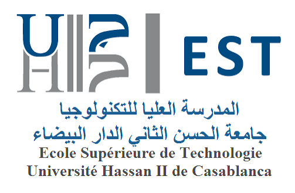

```{=latex}
\makeatletter
\let\ps@plain\ps@empty
\makeatother
\pagenumbering{gobble}
\renewcommand{\thepage}{}
\pagestyle{empty}
\thispagestyle{empty}
\centering
\vspace*{1.5cm}
\includegraphics[width=6cm]{images/logo_estc.png}
\vfill
{\Huge\bfseries\textcolor[HTML]{164E82}{Ouvrage pédagogique}\par}
\vspace{0.35cm}
{\Huge\bfseries\textcolor[HTML]{17324D}{Machine Learning}\par}
\vspace{0.5cm}
{\Large\textcolor[HTML]{17324D}{IAOUSSE M'barek}\par}
\vspace{0.25cm}
{\large\textcolor[HTML]{425466}{École Supérieure de Technologie de Casablanca}\par}
{\large\textcolor[HTML]{425466}{Université Hassan II de Casablanca}\par}
\vspace{0.4cm}
{\large\textcolor[HTML]{425466}{Édition 2026}\par}
\newpage
\thispagestyle{empty}
\centering
\vspace*{\fill}
{\Huge\bfseries\textcolor[HTML]{164E82}{Version en ligne}\par}
\vspace{1cm}
\includegraphics[width=10.5cm]{images/qrcode.png}\par
\vspace{0.5cm}
{\large\textcolor[HTML]{425466}{Scannez ce code pour accéder à la ressource éducative libre.}\par}
\vspace*{\fill}
\newpage
\justifying
```

```{=html}
<h1 class="visually-hidden">Machine Learning</h1>
<section class="ml-cover" aria-label="Couverture de l'ouvrage pédagogique">
  
  <h2>Machine Learning</h2>
  <p class="ml-cover-author">IAOUSSE M'barek</p>
  <p class="ml-cover-institution">École Supérieure de Technologie de Casablanca<br />Université Hassan II de Casablanca</p>
  <p class="ml-cover-edition">Édition 2026</p>
</section>
```

::: {.content-visible when-format="epub"}
# {.unnumbered .unlisted}
:::

```{=html}
<section class="ml-qr-page" aria-label="Accès à la ressource éducative">
  <h2>Version en ligne</h2>
  
  <p>Scannez ce code pour accéder à la ressource éducative libre.</p>
</section>
```


